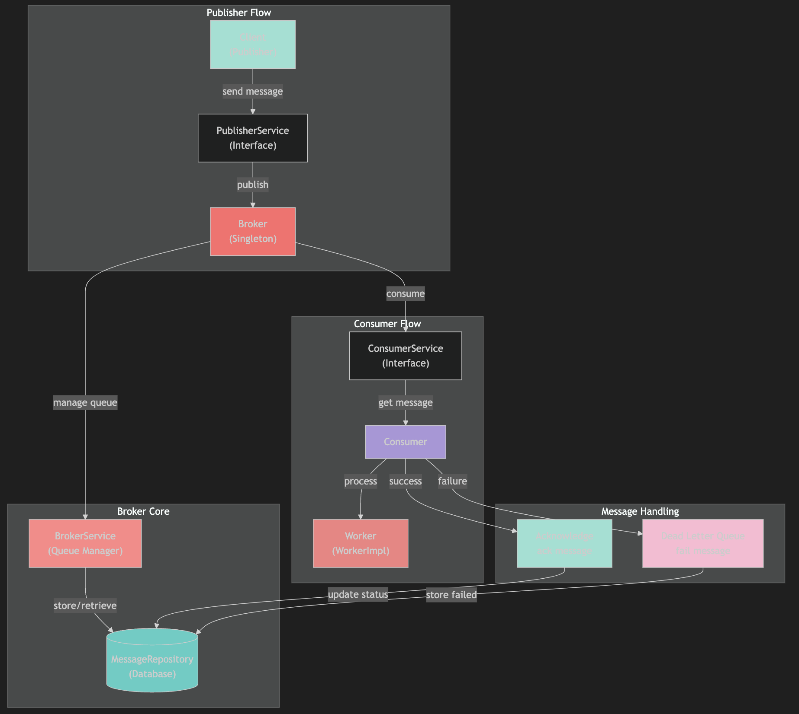

# Event Message Queue

A high-performance, distributed event streaming platform inspired by **Apache Kafka**. Designed for low-latency message delivery and robust horizontal scalability.

---

### 🏗️ Architecture Overview

  

