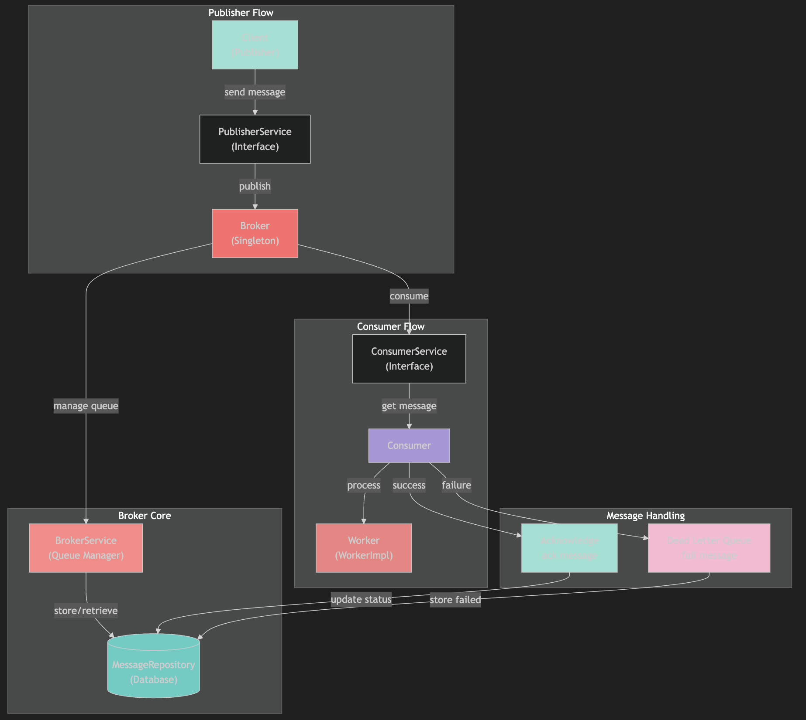

# Event Message Queue

A high-performance, distributed event streaming platform inspired by **Apache Kafka**. Designed for low-latency message delivery and robust horizontal scalability.

---

### 🏗️ Architecture Overview

  

---
Here are two different types of queing system

1. Amazon SQS: 
     When a worker (consumer) receives a message, the message is not deleted immediately.
     Instead, SQS applies a visibility timeout.
     During this timeout:
          The message becomes invisible to other workers.
          Only the worker that received it processes it.
     If the worker:
          Successfully processes it → deletes the message
          Fails or crashes → message becomes visible again after timeout

2. Kafka
     Kafka does not delete or hide messages when consumed
     Topics are divided into partitions
     Each partition is assigned to one consumer (within a group)
     If consumers > partitions → extra consumers are idle
     So P1 -> C1, P2 -> C2, now if we have more consumers than available partitions, then the remaining consumer will sit idle
